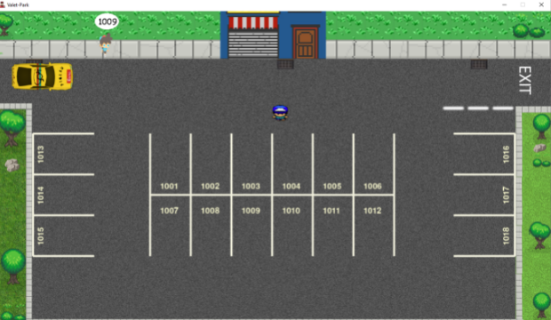

This idea focuses on enabling an reinforcement learning agent to learn valet parking. The environment mimics a 2D game called Park a Lot. In the game, player starts in a parking lot with numbered parking spaces. As time proceeds, customers come and drop their cars at the entrance and also declare their desired parking spot. The customers after a random time come out to the parking lot and wait for their car to be handed over to them. To mimic the real world, car models can be the same however the customer avatar is always unique. The objective of the player is to deliver all the cars within game time. A time penalty is introduced into the game session anytime the entrance is blocked due to unparked cars, the player hits the customer’s car with other cars/objects or if customers are waiting at the exit for a long time.

The main idea is to let the agent learn to valet park, remember the customers and their cars and to deliver all cars within time. The second part of the paper will focus on edge cases such as all parking spots filled, reduced game time, increased probability of customers’ having the same car model. In the above list reduced game time is especially of importance because when a human player plays the game and notices game time is pretty low or they are being penalized. They start memorizing the customer avatar and their car model and ditch the parking lot numbers. We want to see whether the RL agent mimics behaviour similar to this or adopts some other strategy (such as parking near exit). Moreover, a counter to memorization is increased probability of customers’ having the same car model.
After successfully passing a stage, the next stage introduces different environment with added obstacles and changed parking spots orientation. This gamified
version of valet parking can help us unfold interesting behaviour of the RL agent when challenged with human centeric tasks.
A rudimentary pygame version of this idea is present on my github. However, soon I will be porting it to Unity.